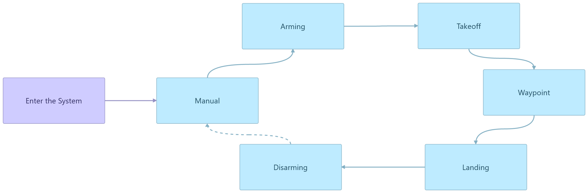
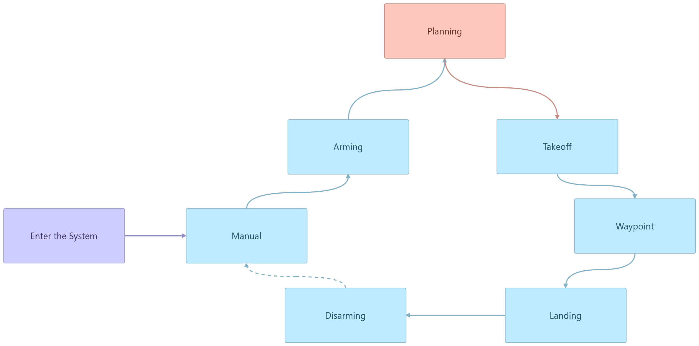
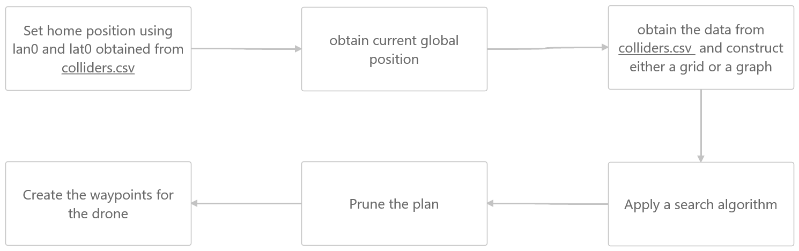

## Project: 3D Motion Planning


---

### Background:
This project is part of the AutoFlying Car Nanodegree. The code is based on the simulation provided by Udacity at https://github.com/udacity/FCND-Motion-Planning

## [Rubric](https://review.udacity.com/#!/rubrics/1534/view) Points

# Required Steps for a Passing Submission:
1. Load the 2.5D map in the colliders.csv file describing the environment.
2. Discretize the environment into a grid or graph representation.
3. Define the start and goal locations.
4. Perform a search using A* or other search algorithm.
5. Use a collinearity test or ray tracing method (like Bresenham) to remove unnecessary waypoints.
6. Return waypoints in local ECEF coordinates (format for `self.all_waypoints` is [N, E, altitude, heading], where the drone’s start location corresponds to [0, 0, 0, 0].
7. Write it up.
8. Congratulations!  Your Done!


---
### Writeup / README

#### 1. Provide a Writeup / README that includes all the rubric points and how you addressed each one.  You can submit your writeup as markdown or pdf.  

You're reading it! Below I describe how I addressed each rubric point and where in my code each point is handled.

### Explain the Starter Code

#### 1. Explain the functionality of what's provided in `motion_planning.py` and `planning_utils.py`
Overall both files uses event driven programming. The main difference between both are the number of states and the transitions as follow:

1. In the `backyard_flyer_solution.py` the transitions are as noted in the figure



2. While in the `motion_planning.py` the transitions are as follow



The planning follow this pattern:


I created a class Fly to simplify the interaction with the drone. You can either try grid or graphs, you can prune or not, you can also plot or not the plans

```python
class Fly(object):
    """
    I created this class to simplify the interaction with the drone.
    My goal here is to allow possible combinations of situations for example
    test graph with breadth first search and combination of pruning methods

    Parameters:
    target_examples: three options 1, 2, 3
    module: graph or grid
    pruning: True or False
    plot: True or False
    """
    def __init__(self, conn, target = target_examples[1], module = 'grid',
                 pruning = True, plot = True):

        self.conn = conn
        self.target = target
        self.module = module
        self.pruning = pruning
        self.plot = plot
```

### Implementing Your Path Planning Algorithm

#### 1. Set your global home position
Here students should read the first line of the csv file, extract lat0 and lon0 as floating point values and use the self.set_home_position() method to set global home. Explain briefly how you accomplished this in your code.


And here is a lovely picture of our downtown San Francisco environment from above!


#### 2. Set your current local position
Here as long as you successfully determine your local position relative to global home you'll be all set. Explain briefly how you accomplished this in your code.


Meanwhile, here's a picture of me flying through the trees!


#### 3. Set grid start position from local position
This is another step in adding flexibility to the start location. As long as it works you're good to go!

#### 4. Set grid goal position from geodetic coords
This step is to add flexibility to the desired goal location. Should be able to choose any (lat, lon) within the map and have it rendered to a goal location on the grid.

#### 5. Modify A* to include diagonal motion (or replace A* altogether)
I defined 4 new actions which corresponds with all possible diagnoal motions and I defined when are these considered a valid actions as follow.

```python
# diagonal Actions

SOUTHEAST = (1, 1, np.sqrt(2))
EASTNORTH = (1, -1, np.sqrt(2))
NORTHWEST = (-1, -1, np.sqrt(2))
WESTSOUTH = (-1, 1, np.sqrt(2))

# Diagnoal Valid Actions. Basically constructed based on combinations
# of the above
if (x + 1 > n or y + 1 > m or grid[x + 1, y] == 1 or grid[x, y + 1] == 1):
    valid_actions.remove(Action.SOUTHEAST)

if (y + 1 > m or x - 1 < 0 or grid[x, y + 1] == 1 or grid[x - 1, y] == 1):
    valid_actions.remove(Action.EASTNORTH)

if (x - 1 < 0 or y - 1 < 0 or grid[x - 1, y] == 1 or grid[x, y - 1] == 1):
    valid_actions.remove(Action.NORTHWEST)

if (y - 1 < 0 or x + 1 > n or grid[x, y - 1] == 1 or grid[x + 1, y] == 1):
    valid_actions.remove(Action.WESTSOUTH)

```

#### 6. Cull waypoints
The approach I used to prune waypoints is a combination of collinearity and bresenham.
This function is located in the ```planning_utils.py```.
The algorithm checks every three points. If there is collinearity then checks using bresenham that there is no obstacles along the line between point 1 and 3 since we will be removing point 2. If so it will remove the middle point. It also uses bresenham by itself to remove the middle points if possible.

```python

def collinearity_bresenham(grid, path, epsilon=1e-6):
    """ Assess collinearity through path points """

    def point(p):
        """ converting points into a square matrix """
        return np.array([p[0], p[1], 1.])

    def collinearity_test(p1, p2, p3, epsilon=epsilon):
        """ Calculating the determinant and checking if < epsilon """
        collinear = False
        mat = np.vstack((point(p1), point(p2), point(p3)))
        det = np.linalg.det(mat)
        if det < epsilon:
            collinear = True

        return collinear

    def find_in_grid(point):
        """ Used by bresenham to find if the grid cell is an obstacle """
        if grid[point[0], point[1]] == 1:
            return 1
        else:
            return 0

    def prune_bresenham(p1, p3):
        """ Uses bresenham algorithm to prune the path """
        error_margin = 1 # represent only one grid is overlapped with an obstacle.
        prune = True
        cells = list(bresenham(p1[0], p1[1], p3[0], p3[1]))
        ingrid = np.array(list(map(find_in_grid, cells)), dtype=np.float64)
        if np.sum(ingrid) > error_margin:
            prune = False
        return prune

    num =0
    while num < len(path) -2:
        # I had some difficulty using a for loop so I ended up just using a
        # a while loop here
        if (collinearity_test(p1=path[num], p2=path[num+1], p3=path[num+2],\
            epsilon=epsilon) and prune_bresenham(p1=path[num], p3=path[num+2])) or\
            prune_bresenham(p1=path[num], p3=path[num+2]):
            path.pop(num+1)
            # we need to subtract one here because if we prune point 2 in a
            # a list [1,2,3], on the next iteration we will miss point 3 as
            # a being a possible point to prune without the num -= 1 below.
            num -= 1

        num += 1

    return path

```

### Execute the flight
#### 1. Does it work?
It works!
